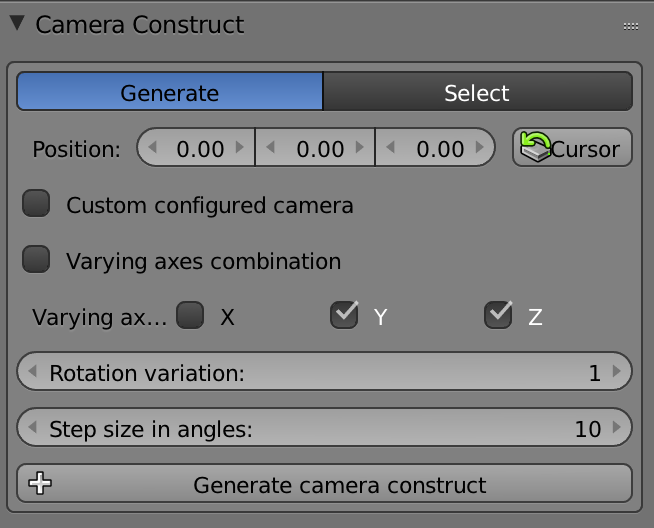
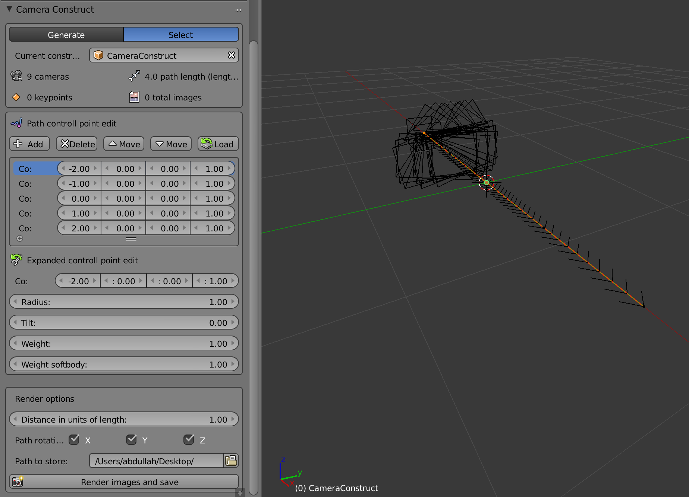
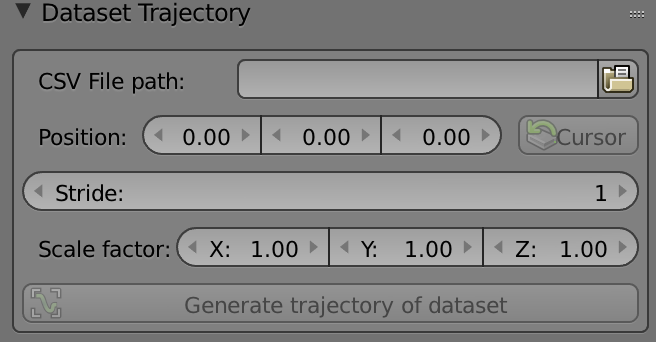
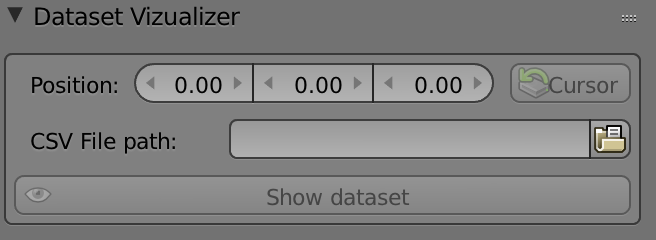
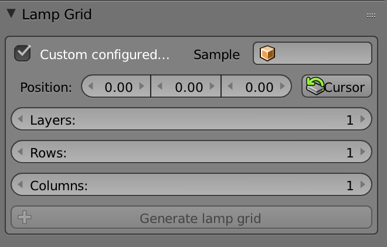

this blender plugins are developed for the version `2.79b`. this plugins are created for generating synthetic image datasets via a camera construct, which contains cameras varied in their axies and following a defined trajectory like the datasets in the paper of [Acharya et. al](https://www.researchgate.net/publication/331543215_BIM-PoseNet_Indoor_camera_localisation_using_a_3D_indoor_model_and_deep_learning_from_synthetic_images) or in my [bachelorthesis](https://seafile.inf.bi.ruhr-uni-bochum.de/f/c877772ca14a4ecd8286/).
# indepented plugins:

## camera_construction.py
generates and manages a camera construct. one construct can include many cameras. the amount of the camera can be setted over the varying axes. one construct includes a NURBs-path, which can be modified manuelly. the camera_construct object will follow the path in the step size setted before.

 

## dataset_trajectory.py
generates a NURBs-path from `TUM trajectory` files

 

## dataset_vizualizer.py
vizualize the dataset via camera object from 'TUM' trajectory files

 

## lamp_grid_generator.py
generates a grid of lamp objects. it's just a helper for creating lamps objects in defined margin.

 